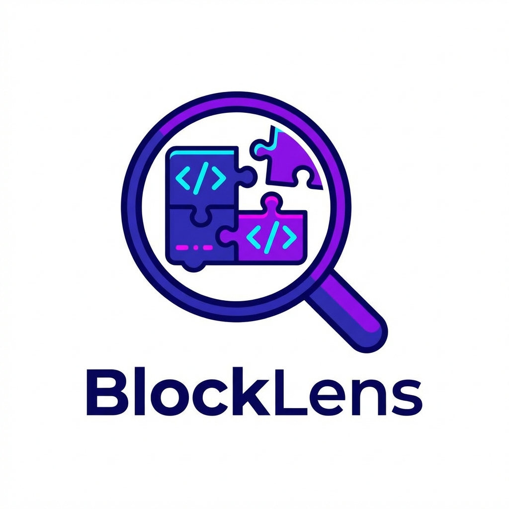

<p align="center">
  
</p>

<h1 align="center">BlockLens</h1>

<p align="center">
  <strong>A powerful AIA Project Viewer and AIX Extension Analyzer for App Inventor 2 & its distributions</strong>
</p>

<p align="center">
  <a href="https://github.com/TechHamara/BlockLens/">
    
  </a>
  
  
  
</p>

<p align="center">
  View your projects and analyze extensions directly in your browser without logging into any Creator.
</p>

---

## ✨ Features

| Feature | Status | Description |
|---------|--------|-------------|
| **Project Viewer (.aia)** | ✅ Complete | View screens, components, assets, and block logic |
| **Extension Analyzer (.aix)** | ✅ Complete | Inspect extension methods, events, and properties with auto-generated blocks |
| **Documentation Generator** | ✅ Complete | Generate and export Markdown documentation for your extensions |
| **Smart Block Export** | ✅ Complete | Download all blocks as a single ZIP file or individual PNGs |
| **Helper Support** | ✅ Complete | Renders interconnected helper blocks (dropdowns) for properties |
| **Dark Mode** | ✅ Complete | Switch between light and dark themes for comfortable viewing |
| **Block Color Themes** | ✅ Complete | Toggle between App Inventor, Kodular, and Niotron block colors |
| **Responsive Design** | ✅ Complete | Works seamlessly on mobile and desktop devices |
| **Offline Capable** | ✅ Complete | Easy to set up and run locally |

---

## 🚀 Key Functions

### For AIA Projects
- 📂 **Screen Explorer** - Browse through all screens in your project
- 🧩 **Component Tree** - View hierarchical component structure
- 📁 **Asset Manager** - Preview images, audio, and other assets
- 🔲 **Block Viewer** - Visualize all block logic with proper rendering

### For AIX Extensions
- 📊 **Extension Info** - View extension metadata and package details
- 🎯 **Methods Inspector** - Explore all methods with parameters and return types
- ⚡ **Events Analyzer** - See all events with their parameters
- 🔧 **Properties Browser** - View get/set properties with types in a clean vertical list
- 🎨 **Theme Switcher** - Toggle block colors (App Inventor, Kodular, Niotron)
- � **Dictionary Helpers** - Automatically renders helper dropdowns for enum properties
- � **Bulk Export** - Download full documentation (Markdown + Images) as a ZIP file
- 📝 **Auto Documentation** - Generate professional markdown docs with one click

---

## 🛠️ Technical Features

- **Pure Vanilla JavaScript** - No heavy frameworks, fast loading
- **Blockly Integration** - Authentic block rendering using MIT App Inventor's Blockly library
- **JSZip Support** - Client-side ZIP handling for AIA/AIX files
- **Marked.js** - Beautiful markdown rendering
- **html2canvas** - High-quality PNG export functionality

---

## 🎨 UI/UX Highlights

- 🌓 **Theme Toggle** - Smooth light/dark mode transition
- 📱 **Mobile First** - Swipe-based navigation on mobile
- 🎭 **Glass Morphism** - Modern glassmorphism design elements
- ✨ **Micro Animations** - Subtle hover effects and transitions
- 🎨 **Color Coded Blocks** - Events, methods, properties with distinct colors

---

## 📦 Installation

<details>
<summary><strong>🌐 Use Online (Recommended)</strong></summary>

Simply visit: **[https://techhamara.github.io/BlockLens/](https://techhamara.github.io/BlockLens/)**

No installation required! Just upload your `.aia` or `.aix` file.
</details>

<details>
<summary><strong>💻 Run Locally</strong></summary>

### Prerequisites
- Python 2.7 or Python 3.x
- An internet connection (for initial setup)

### Steps
1. Clone or download this repository
   ```bash
   git clone https://github.com/TechHamara/BlockLens.git
   ```

2. Navigate to the project folder
   ```bash
   cd ai-unchive
   ```

3. Install dependencies
   ```bash
   pip install requests
   ```

4. Start the server
   ```bash
   python setup.py serve
   ```

5. Open `http://localhost:8000` in your browser
</details>

---

## 🤝 Contributing

We welcome contributions from the community! Here's how you can help:

### Ways to Contribute

| Type | Description |
|------|-------------|
| 🐛 **Bug Reports** | Found a bug? Open an issue with steps to reproduce |
| 💡 **Feature Requests** | Have an idea? Share it in discussions |
| 🔧 **Pull Requests** | Fixed something? Submit a PR! |
| 📝 **Documentation** | Improve our docs and README |
| 🌍 **Translations** | Help translate to other languages |

### Development Guidelines

1. **Fork** the repository
2. **Create** a feature branch (`git checkout -b feature/amazing-feature`)
3. **Commit** your changes (`git commit -m 'Add amazing feature'`)
4. **Push** to the branch (`git push origin feature/amazing-feature`)
5. **Open** a Pull Request

### Code Style
- Use clear, descriptive variable names
- Add comments for complex logic
- Follow existing code patterns
- Test changes in both light and dark modes

---

## 📋 Changelog

### Latest Updates
- ✅ Version 1.0.0 Added 

---

## 📄 License

This project is licensed under the **MIT License** - see the [LICENSE](LICENSE) file for details.

---

## 🙏 Credits

- **[Peter Mathijssen](https://community.kodular.io/u/peter/summary)** - Original logo design
- **[MIT App Inventor Blockly](https://github.com/mit-cml/appinventor-sources)** - Block rendering library (forked from ai-unchive [https://github.com/Kodular/ai-unchive](https://github.com/Kodular/ai-unchive))
- **[JSZip](https://stuk.github.io/jszip/)** - ZIP file handling
- **[Marked.js](https://marked.js.org/)** - Markdown parsing

---

<p align="center">
  Made with ❤️ by <a href="https://github.com/TechHamara">TechHamara</a>
</p>

<p align="center">
  <a href="https://techhamara.github.io/BlockLens/">🌐 Website</a> •
  <a href="https://github.com/TechHamara/BlockLens/issues">🐛 Report Bug</a> •
  <a href="https://github.com/TechHamara/BlockLens/discussions">💬 Discussions</a>
</p>
